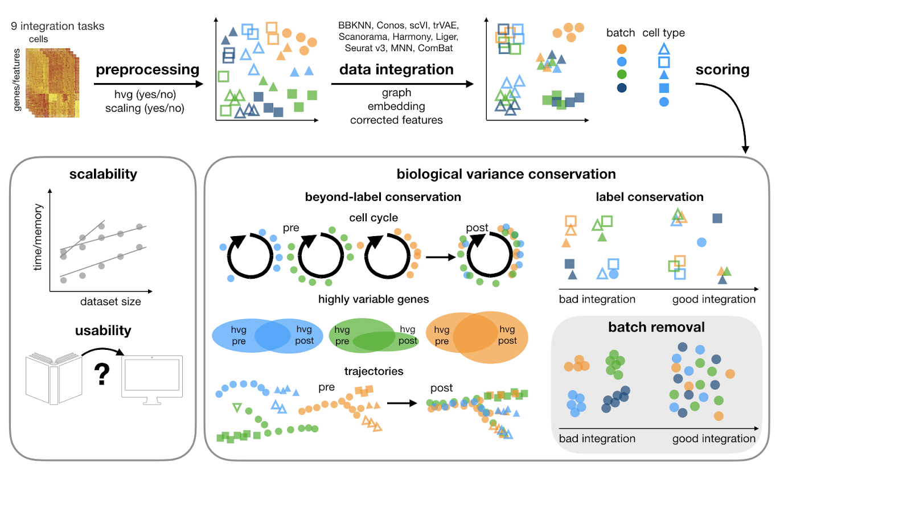

# Benchmarking atlas-level data integration in single-cell genomics

This repository contains the code for our benchmarking study for data integration tools.
In [our study](https://www.biorxiv.org/content/10.1101/2020.05.22.111161v1), we benchmark 16
methods ([see here](##Tools)) with 4 combinations of preprocessing steps leading to 68 methods combinations on 85
batches of gene expression and chromatin accessibility data.



## Resources

+ On our [website](https://theislab.github.io/scib-reproducibility) we visualise the results of the study.

+ The reusable pipeline we used in the study can be found in the
  separate [scib pipeline](https://github.com/theislab/scib-pipeline.git) repository. It is reproducible and automates
  the computation of preprocesssing combinations, integration methods and benchmarking metrics.

+ For reproducibility and visualisation we have a dedicated
  repository: [scib-reproducibility](https://github.com/theislab/scib-reproducibility).

### Please cite:

**Benchmarking atlas-level data integration in single-cell genomics.**
MD Luecken, M Büttner, K Chaichoompu, A Danese, M Interlandi, MF Mueller, DC Strobl, L Zappia, M Dugas, M Colomé-Tatché,
FJ Theis bioRxiv 2020.05.22.111161; doi: https://doi.org/10.1101/2020.05.22.111161_

## Package: `scib`

We created the python package called `scib` that uses `scanpy` to streamline the integration of single-cell datasets and
evaluate the results. For evaluating the integration quality it provides a number of metrics.

### Requirements

+ Linux or UNIX system
+ Python >= 3.7
+ 3.6 <= R <= 4.0

We recommend working with environments such as Conda or virtualenv, so that python and R dependencies are in one place.
Please also check out [scib pipeline](https://github.com/theislab/scib-pipeline.git) for ready-to-use environments.
Alternatively, manually install the package on your system using pip, described in the next section. 

### Installation

The `scib` python package is in the folder scib. You can simply install it from the root of this repository using

```
pip install .
```

Alternatively, you can also install the package directly from GitHub via

```
pip install git+https://github.com/theislab/scib.git
```

Additionally, in order to run the R package `kBET`, you need to install it through R.

```R
devtools::install_github('theislab/kBET')
```

> **Note:** By default dependencies for integration methods are not installed due to dependency clashes.
> In order to use integration methods, see the next section

### Installing additional packages

This package contains code for running integration methods as well as for evaluating their output. However, due to
dependency clashes, `scib` is only installed with the packages needed for the metrics. In order to use the integration
wrapper functions, we recommend to work with different environments for different methods, each with their own
installation of `scib`. You can install optional Python dependencies via pip as follows:

```
pip install .[bbknn]  # using BBKNN
pip install .[scanorama]  # using Scanorama
pip install .[bbknn,scanorama]  # Multiple methods in one go
```

The `setup.cfg` for a full list of Python dependencies. For a comprehensive list of supported integration methods,
including R packages, check out the `Tools`.

## Usage

The package contains several modules for the different steps of the integration and benchmarking pipeline. Functions for
the integration methods are in `scib.integration` or for short `scib.ig`. The methods can be called using

```py
scib.integration.<method>(adata, batch=<batch_key>)
```

where `<method>` is the name of the integration method and `<batch_key>` is the name of the batch column in `adata.obs`.
For example, in order to run Scanorama, on a dataset with batch key 'batch' call

```py
scib.integration.scanorama(adata, batch='batch')
```

> **Warning:** the following notation is deprecated.
> ```
> scib.integration.run<method>(adata, batch=<batch_key>)
> ```
> Please use the snake case naming without the `run` prefix.

Some integration methods (`scgen`, `scanvi`) also use cell type labels as input. For these, you need to additionally provide
the corresponding label column.

```py
scgen(adata, batch=<batch_key>, cell_type=<cell_type>)
scanvi(adata, batch=<batch_key>, labels=<cell_type>)
```

`scib.preprocessing` (or `scib.pp`) contains functions for normalising, scaling or selecting highly variable genes per batch
The metrics are under `scib.metrics` (or `scib.me`).

## Metrics

For a detailed description of the metrics implemented in this package, please see
the [manuscript](https://www.biorxiv.org/content/10.1101/2020.05.22.111161v2).

### Batch removal metrics include:

- Principal component regression `pcr_comparison()`
- Batch ASW `silhouette()`
- K-nearest neighbour batch effect `kBET()`
- Graph connectivity `graph_connectivity()`
- Graph iLISI `lisi_graph()`

### Biological conservation metrics include:

- Normalised mutual information `nmi()`
- Adjusted Rand Index `ari()`
- Cell type ASW `silhouette_batch()`
- Isolated label score F1 `isolated_labels()`
- Isolated label score ASW `isolated_labels()`
- Cell cycle conservation `cell_cycle()`
- Highly variable gene conservation `hvg_overlap()`
- Trajectory conservation `trajectory_conservation()`
- Graph cLISI `lisi_graph()`

### Metrics Wrapper Functions
We provide wrapper functions to run multiple metrics in one function call.
The `scib.metrics.metrics()` function returns a `pandas.Dataframe` of all metrics specified as parameters.

```py
scib.metrics.metrics(adata, adata_int, ari=True, nmi=True)
```

Furthermore, `scib.metrics.metrics()` is wrapped by convenience functions that only select certain metrics:

+ `scib.me.metrics_fast()` only computes metrics that require little preprocessing
+ `scib.me.metrics_slim()` includes all functions of `scib.me.metrics_fast()` and adds clustering-based metrics
+ `scib.me.metrics_all()` includes all metrics

## Tools

Tools that are compared include:

- [BBKNN](https://github.com/Teichlab/bbknn) 1.3.9
- [Combat](https://scanpy.readthedocs.io/en/stable/api/scanpy.pp.combat.html) [paper](https://academic.oup.com/biostatistics/article/8/1/118/252073)
- [Conos](https://github.com/hms-dbmi/conos) 1.3.0
- [DESC](https://github.com/eleozzr/desc) 2.0.3
- [FastMNN](https://bioconductor.org/packages/batchelor/) (batchelor 1.4.0)
- [Harmony](https://github.com/immunogenomics/harmony) 1.0
- [LIGER](https://github.com/MacoskoLab/liger) 0.5.0
- [MNN](https://github.com/chriscainx/mnnpy) 0.1.9.5
- [SAUCIE](https://github.com/KrishnaswamyLab/SAUCIE)
- [Scanorama](https://github.com/brianhie/scanorama) 1.7.0
- [scANVI](https://github.com/chenlingantelope/HarmonizationSCANVI) (scVI 0.6.7)
- [scGen](https://github.com/theislab/scgen) 1.1.5
- [scVI](https://github.com/YosefLab/scVI) 0.6.7
- [Seurat v3](https://github.com/satijalab/seurat) 3.2.0 CCA (default) and RPCA
- [TrVae](https://github.com/theislab/trvae) 0.0.1
- [TrVaep](https://github.com/theislab/trvaep) 0.1.0
