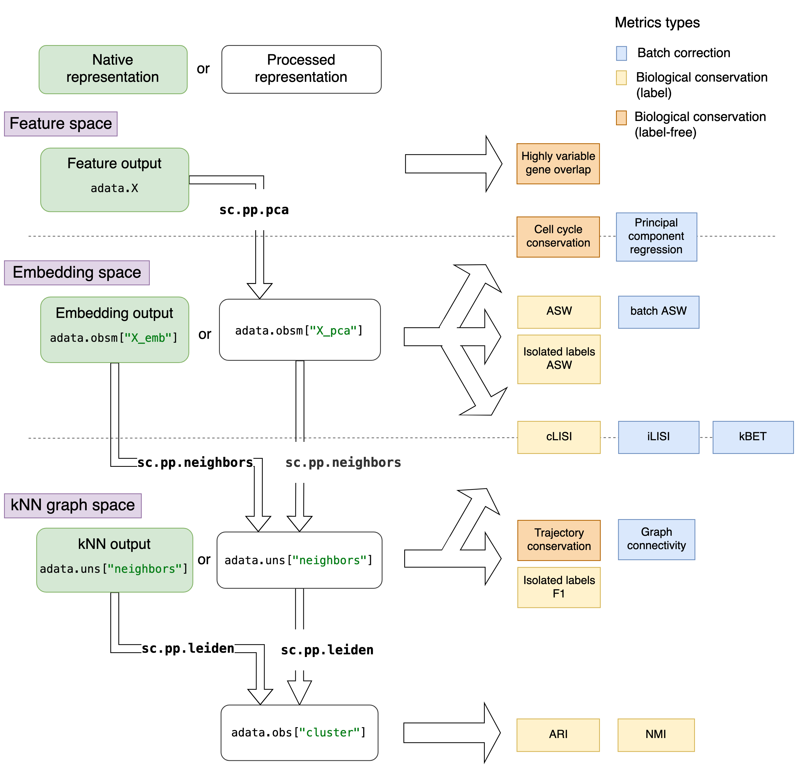

Metrics
=======

.. currentmodule:: scib.metrics

This package contains all the metrics used for benchmarking scRNA-seq data integration performance.
The metrics can be classified into biological conservation and batch removal metrics.
For a detailed description of the metrics implemented in this package, please see our `publication`_.

.. _publication: https://doi.org/10.1038/s41592-021-01336-8

Preprocessing data for metrics
------------------------------

The ``anndata`` objects returned by the integration methods require some processing for most metrics.
This involves feature selection (highly variable gene selection), PCA, kNN graph computation and clustering.
For preprocessing, ``scib`` provides the function :func:`~scib.preprocessing.reduce_data`.
Whether preprocessing steps are needed, and which part of the anndata object preprocessing should be performed on
depends on the output type of the integration and the metric.
Output types of integration methods can be

    1. feature output: a corrected count matrix
    2. embedding output:corrected embedding
    3. kNN output: corrected kNN graph

Each metrics assumes that the data representation it requires (e.g. count matrix, embedding, kNN graph) is available in
the ``anndata`` object.
If that is not the case, the data needs to be preprocessed accordingly or, for cases where that is not possible, the
metric cannot be applied to that data representation.
The data representation not only determines which metrics can be evaluated, but for some metrics it also determines how
they are computed.
For instance, the principle component regression computes a PCA, which can be done not just on a full feature matrix
but also on an integrated embedding.

The metrics can either be used ot evaluate a dataset or to evaluate the integration performance.
For the latter case, it is important to note that different integration methods return different data representations.
These are denoted as "native representation" in the figure below.

   **Overview of metrics with relation to integration outputs and preprocessing steps.**
   Metrics are arranged depending on the data representation they require.
   The different data representations are separated by dotted lines in the figure.
   Native data representations (from integration output) are depicted in green boxes, while the processed
   representations are in white boxes.
   The preprocessing commands are denoted on the arrows between data representations.
   Metrics that are evaluate differently for different data representations are depicted by metrics on top of the dotted
   lines.

.. note::
    Whether preprocessing is required, depends on the data representation that you want to evaluate.
    For example, a corrected feature matrix needs to be transformed into a PCA first for the ASW metrics, whereas a native
    embedding output can be used directly for the same metrics.

Biological Conservation Metrics
-------------------------------

Biological conservation metrics quantify either the integrity of cluster-based metrics based on clustering results of
the integration output, or the difference in the feature spaces of integrated and unintegrated data.
Each metric is scaled to a value ranging from 0 to 1 by default, where larger scores represent better conservation of
the biological aspect that the metric addresses.

.. autosummary::
    :toctree: api/

    hvg_overlap
    silhouette
    isolated_labels_f1
    isolated_labels_asw
    nmi
    ari
    cell_cycle
    trajectory_conservation
    clisi_graph

Batch Correction Metrics
------------------------

Batch correction metrics values are scaled by default between 0 and 1, in which larger scores represent better batch
removal.

.. autosummary::
    :toctree: api/

    graph_connectivity
    silhouette_batch
    pcr_comparison
    kBET
    ilisi_graph

Metrics Wrapper Functions
-------------------------

For convenience, ``scib`` provides wrapper functions that, given integrated and unintegrated adata objects, apply
multiple metrics and return all the results in a ``pandas.Dataframe``.
The main function is :func:`~scib.metrics.metrics`, that provides all the parameters for the different metrics.

.. code-block:: python

    scib.metrics.metrics(adata, adata_int, ari=True, nmi=True)

The remaining functions call the :func:`~scib.metrics.metrics` for

Furthermore, :func:`~scib.metrics.metrics()` is wrapped by convenience functions with preconfigured subsets of metrics
based on expected computation time:

+ :func:`~scib.metrics.metrics_fast()` only computes metrics that require little preprocessing
+ :func:`~scib.metrics.metrics_slim()` includes all functions of :func:`~scib.metrics.metrics_fast()` and adds clustering-based metrics
+ :func:`~scib.metrics.metrics_all()` includes all metrics

.. autosummary::
    :toctree: api/

    metrics
    metrics_fast
    metrics_slim
    metrics_all

.. raw:: html

    <h2>Auxiliary Functions</h2>

.. autosummary::
    :toctree: api/

    lisi_graph
    pcr
    pc_regression
