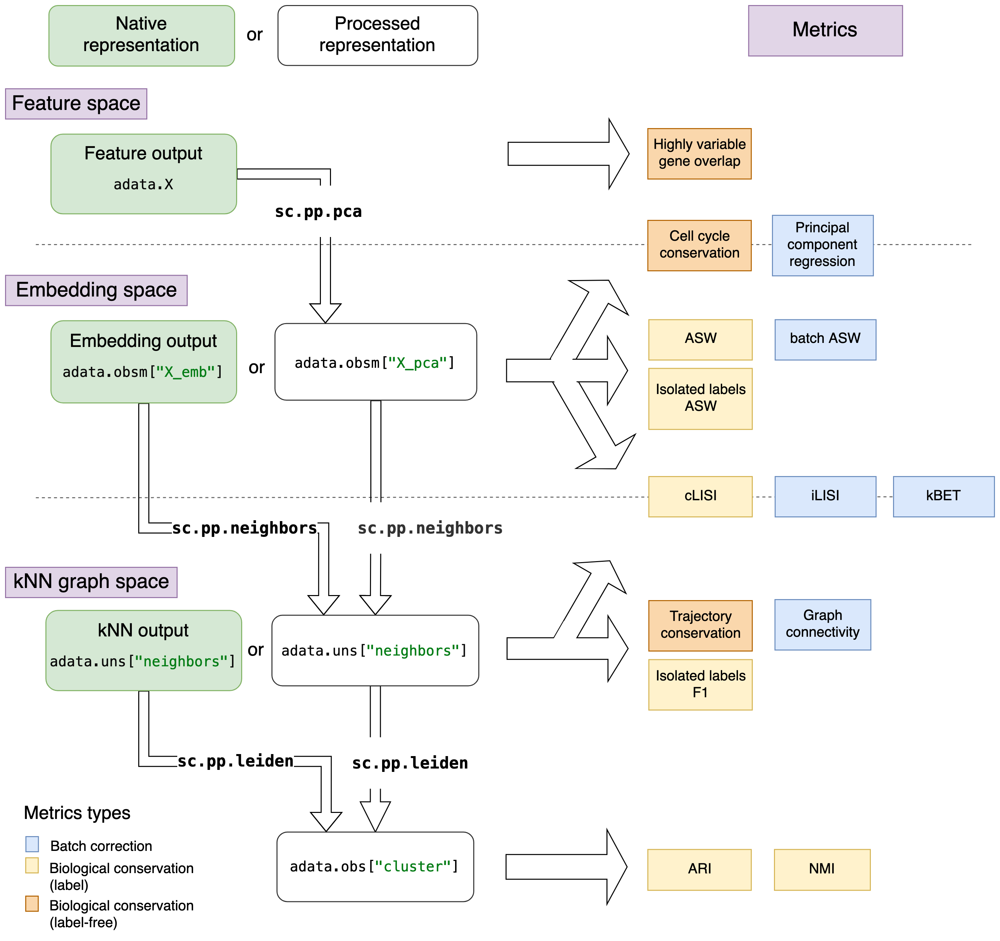

.. _preprocessing:

User Guide
==========

The metrics can either be used to evaluate a dataset or to evaluate the integration performance on different
representations of the data.
Data representations can be one of the following:

1. **Feature space:** a feature-level expression matrix (usually normalised & log-transformed counts or corrected counts from integration)
2. **Embedding space:** PCA of the feature-level expression matrix or an embedding from an integration method
3. **kNN graph space:** a kNN graph on a PCA or an embedding

Unintegrated feature matrices can simply be reduced to a PCA embedding or kNN graph using the according ``scanpy``
functions or the  wrapper :func:`~scib.preprocessing.reduce_data`.
The integrated output can come in one of the three representations, which are denoted as "native representation" in the
figure below.
Each metric assumes that the data representation it requires is available in the ``anndata`` object.
If that is not the case, the data needs to be preprocessed accordingly or, for cases where that is not possible, the
metric cannot be applied to that data representation.

This means that native representations in kNN graph space can only be evaluated by graph based metrics, while embedding
space outputs can be evaluated by embedding and graph based metrics, the latter requiring processing for the kNN graph.
From a feature space native representation one can compute embedding space (PCA on expression matrix, optionally with
highly variable gene selection) and kNN graph (on PCA) and all metrics are applicable.
These relationships are visualised in the figure below.

   **Overview of metrics and processing steps for different data representations.**
   Metrics are arranged depending on the data representation they require.
   The different data representations are separated by dotted lines in the figure.
   Native data representations (from integration output) are depicted in green boxes, while the processed
   representations are in white boxes.
   The preprocessing commands are denoted on the arrows between data representations, highly variable gene selection is
   not shown here explicitly.
   Metrics that are evaluate differently for different data representations are depicted by metrics on top of the dotted
   lines.

The data representation not only determines which metrics can be evaluated, but also how they are computed.
For instance, the principle component regression :func:`~scib.metrics.pcr_comparison` requires a PCA and variance
contributions, which would classically be computed a full feature matrix but can also be computed on an integrated
embedding matrix.

kNN graph output
----------------

KNN graph outputs can only be evaluated with metrics that use a kNN graph as input.
The graph must be located in ``adata.obsp['neighbors']`` and ``adata.obsp['connectivities']``.
Some of these methods require cluster assignments to compare against known cell labels, which requires clustering.
We recommend to use resolutions that are optimised to the hierarchy of the cell labels for a more representative
cluster assignment.

.. code-block:: python

    scib.me.cluster_optimal_resolution(adata, cluster_key="cluster", label_key="celltype")

Embedding output
----------------

The embedding should be stored in ``adata.obsm``, by default under key ``'X_emb'``.
If the metric requires an embedding, no preprocessing is needed.
Some metrics require the following:

    1. kNN graph
    2. Clustering with optimised resolution

.. code-block:: python

    sc.pp.neighbors(adata, use_rep="X_emb")
    scib.me.cluster_optimal_resolution(adata, cluster_key="cluster", label_key="celltype")

Feature output
--------------

Feature output processing contains the same steps that are computed on unintegrated data before integration.
Feature output requires processing of the count matrix in the following steps:

    1. Highly variable gene selection (skip, if working on feature space subset)
    2. PCA
    3. kNN graph
    4. Clustering with optimised resolution

Note that, depending on the metric, not all steps are required.
If the metrics uses an expression matrix, no preprocessing is needed, while the PCA should be used for all metrics that
evaluate an embedding.

.. code-block:: python

    # use wrapper function for the first 3 steps
    scib.pp.reduce_data(
        adata, n_top_genes=2000, batch_key="batch", pca=True, neighbors=False
    )
    scib.me.cluster_optimal_resolution(adata, cluster_key="cluster", label_key="celltype")
